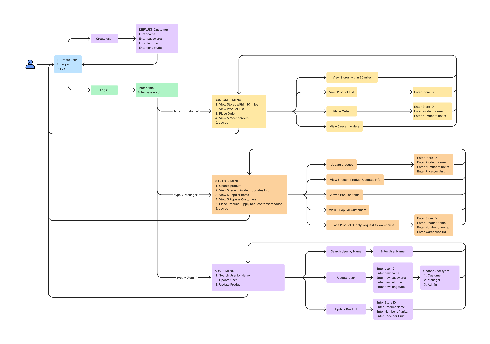
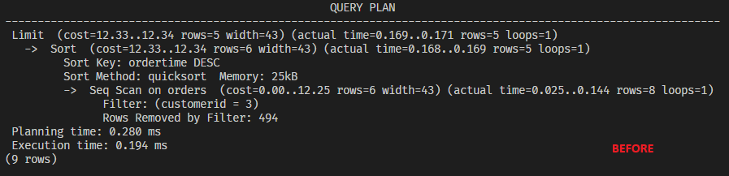

## What is Amazon Storefront DB?

This is a group project for Database System Managment class. It is a database-driven application for managing user accounts, stores, products, and orders. It allows users to create accounts, log in, and perform various actions based on their user type, such as viewing stores, products, and placing orders. The system includes SQL queries for data retrieval and manipulation, as well as triggers and indices for optimizing database operations.

## Group Information

[Adlai Morales-Bravo](https://github.com/AdlaiMB) 
[Denis Melnikov](https://github.com/deet5)

## Implementation Description

You can create a new account using `Create user`. By default every new user has the type `Customer` which can later be modified by `Admin`. When the account is created you can log in using `Log in` option. Depending on the user type you have different menu options. For example, if your user type is `Customer`, you can view stores within 30 miles, view product list, place an order or view 5 recent orders. Here is the interface flow to better understand what options are available:



### Queries

#### Return tuples with a given store ID.
```
SELECT *
FROM Store
WHERE storeid = <storeID>;
```
This query is to validate the store ID input.

#### Add new user.
```
INSERT INTO USERS (name, password, latitude, longitude, type) VALUES (<name>, <password>, <latitude>, <longitude>, <type>);
```
This query is for `Create User` menu option.

#### Find existing user.
```
SELECT *
FROM USERS
WHERE name = <name> AND password = <password>;
```
This query is for `Log in` menu option.

#### Return the user type given user ID.
```
SELECT type
FROM Users
WHERE userid = <userID>;
```
This query is to determine which menu to display after `Log in`.

####  Return manager ID given store ID.
```
SELECT managerid
FROM Store
WHERE storeid = <storeID>;
```
This query is used to validate that the manager has access only to their storefront.

#### Return product infromation given store ID and product name.
```
SELECT *
FROM Product
WHERE storeid = <storeID> AND productname = <productName>;
```
This query is used to check if the store carries the product.

#### Update product information in a given store.
```
UPDATE Product SET priceperunit = <PricePerUnit>, numberofunits = <NumberofUnits> WHERE storeid = <StoreID> AND productname = <ProductName>;
```
This query is to update the product information.

#### Add information about the product update to the ProductUpdates table.
```
INSERT INTO ProductUpdates (managerID, storeid, productname, updatedOn) VALUES (<ManagerID>, <StoreID>, <ProductName>, <CurrentDate>);
```
This query is to add information about the product update by the `Manager` or `Admin`.

#### Return the last 5 updates given the store ID.
```
SELECT *
FROM ProductUpdates
WHERE storeid = <StoreID>
ORDER BY updatedOn DESC
LIMIT 5;
```
This query is used to return the last 5 updates in the store.

#### For each product in a given store return the product name and the amount of that prosuct ordered. Print 5 most ordered products.
```
SELECT productname, SUM(unitsordered) AS total_units_sold
FROM Orders
WHERE storeid = <StoreID>
GROUP BY productname
ORDER BY total_units_sold DESC
LIMIT 5;
```
This query is used to print the most popular products in the store.

#### For each customer return the number of orders that customaer made. Return 5 customers with the most orders.
```
SELECT customerid, COUNT(*) AS total_orders
FROM Orders
WHERE storeid = <StoreID>
GROUP BY customerid
ORDER BY total_orders DESC
LIMIT 5;
```
This query is used to print the most popular `Customer`s.

#### Return all warehouse information given warehouse ID.
```
SELECT *
FROM Warehouse
WHERE warehouseid = <WarehouseID>;
```
This query is used to check if the given warehouse exists.

#### Add a new record to the product supply request.
```
INSERT INTO ProductSupplyRequests (managerid, storeid, productname, unitsrequested, warehouseid) VALUES (<ManagerID>, <StoreID>, <ProductName>, <UnitsRequested>, <WarehouseID>);
```
This query is sused to add the product supply request from the `Manager`.

#### Change user information. 
```
UPDATE Users SET name = <UserName>, password = <Password>, latitude = <Latitude>, longitude = <Longitude>, type = <UserType> WHERE userid = <UserID>;
```
This query is used by `Admin` to update user information.

#### Return all store's latitude and longitude.
```
SELECT storeID, latitude, longitude FROM Store
```
This is query is used to get all store's latitude and longitude for checking distance to customer.

#### Return user's latitude and longitude given user ID.
```
SELECT latitude, longitude FROM Users WHERE userid = <UserID>
```
This is query is used to get the users latitude and longitude for checking store distance.

#### Return all store's givin store IDs.
```
SELECT storeID FROM Store WHERE storeID IN <StoreIDs> 
```
This query is used to check if stores are within a set of store IDs with a valid distance to customer. 

#### Return products given store ID.
```
SELECT productName, numberOfUnits, pricePerUnit FROM Product WHERE storeID = <StoreId>
```
This query if used to return all products within a store.

#### Return store latitude and longitdue given store ID.
```
SELECT latitude, longitude FROM Store WHERE storeid = <StoreID>
```
This query is used to get a store to check its distance to a customer. 

#### Update product number of units in a given store.
```
UPDATE Product SET numberofunits = <NumberofUnits> WHERE storeid = <StoreID> AND productname = <ProductName>
```
This query is used to update a prouduct from a order from a `Customer`.

#### Add a new record to the order.
```
INSERT INTO Orders (customerid, storeid, productname, unitsOrdered, orderTime) VALUES (<CustomerID>, <StoreID>, <ProductName>, <UnitsOrdered>, <CurrentDate>)
```
This query is to insert a new order from a `Customer`

#### Return the last 5 orders given customer ID.
```
SELECT productName, unitsOrdered, orderTime FROM Orders WHERE customerID = <CustomerID> ORDER BY orderTime DESC LIMIT 5
```
This query is used to get the five latest orders from a `Customer`.

### Extra credit

#### Triggers
```
DROP TRIGGER IF EXISTS trg_product_update ON Product;

CREATE OR REPLACE LANGUAGE plpgsql;
CREATE OR REPLACE FUNCTION product_update()
RETURNS "trigger" AS 
$BODY$
BEGIN
  INSERT INTO ProductUpdates (storeid, productname, updatedon, managerid)
  VALUES (NEW.storeid, NEW.productname, now(), (SELECT managerid FROM Store WHERE storeid = NEW.storeid));
  RETURN NEW;
END;
$BODY$
LANGUAGE plpgsql VOLATILE;

CREATE TRIGGER trg_product_update
AFTER UPDATE ON Product
FOR EACH ROW EXECUTE PROCEDURE product_update();
```
This trigger adds information to the `ProductUpdates` after a `Manager` updates the product. 

```
DROP TRIGGER IF EXISTS trg_new_order ON Orders;

CREATE OR REPLACE LANGUAGE plpgsql;
CREATE OR REPLACE FUNCTION product_units_update()
RETURNS "trigger" AS 
$BODY$
DECLARE 
  oldUnits  integer;
BEGIN
  oldUnits := (SELECT numberOfUnits FROM Product WHERE storeID = NEW.storeID AND productName = NEW.productName);
  UPDATE Product SET numberOfUnits = oldUnits - NEW.unitsOrdered WHERE storeID = NEW.storeID AND productname = NEW.productName;
  RETURN NEW;
END;
$BODY$
LANGUAGE plpgsql VOLATILE;

CREATE TRIGGER trg_new_order
AFTER INSERT ON Orders
FOR EACH ROW EXECUTE PROCEDURE product_units_update();
```
This trigger updates information on the `Product` after a `Customer` places an order.

#### Indices
```
CREATE INDEX storeID_on_products ON product USING btree (storeid);
```
This index improves the query on `Product`.


```
CREATE INDEX storeID_on_orders ON orders USING btree (storeid);
```
This index improves the query on `Orders`.


```
CREATE INDEX customerID_on_orders ON orders USING btree (customerid);
```
This index improves the query on `Orders`.




## Problems/Findings

- Some user types in the USER schema have extra whispaces. So when we compare type `Manager` with the string "Manager" it returns `false`. We solved it by trimming the return type from the schema.
- There was no type checking for user input. So we implemented `isInteger()` and `isDouble()` functions to check if the user inputs correct values.
- The trigger to add information product update assumes that only `Manager`s are responsible for product updates. So if `Admin` makes any changes to the product, their ID will not be in the `managerid` column.
